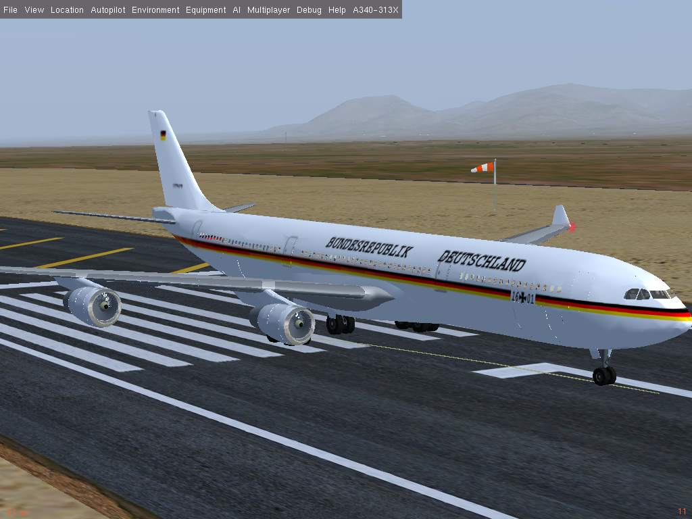

# A340-313X
FG Aircraft | Airbus A340-313X by Andino

it0uchpods is now maintaining this aircraft.

Postscript: how to use the autopilot

It might seem difficult, but it is not. It works so:

- Mouse wheel: change the value (Hdg, VS, Alt, Hold, Speed, etc.)
- Mouse left click: select the function to activate it: (Alt, Hold Alt, Hdg, Loc, App, VS, Throttle, etc.)

That is all !!!
